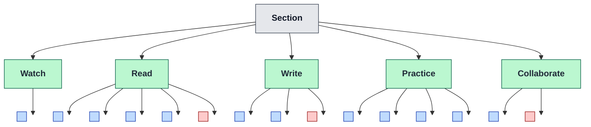
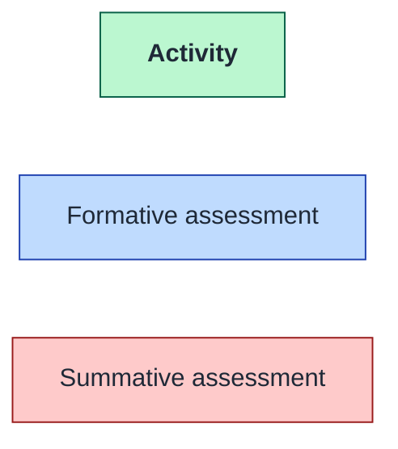

# Activity Types & Assessment Patterns (Conceptual)

A more general view of the activity-centric model — independent of the current implementation. A section can host many *kinds* of activity (watch, listen, read, write, practice, collaborate, reflect, build, …), and each activity carries whatever number of assessments fits its purpose: zero, one, or many. Most are **formative** (scored for feedback, not graded); a smaller number are **summative** (counted toward a grade).

**Legend**

## Reading the diagram

- **Activity types are open-ended.** The five shown (watch, read, write, practice, collaborate) are illustrative. The model accommodates listen, reflect, build, discuss, present, code, design, peer-teach, and so on. The set is a design choice per course, not fixed by the architecture.
- **Assessment count varies by purpose.**
  - *Watch* often needs only a single attention check.
  - *Read* may carry many small comprehension probes (retrieval practice over a long passage).
  - *Practice* is mostly assessment by nature — the activity *is* the problem set.
  - *Collaborate* may end in a graded group artifact.
- **Formative is the default.** Most assessments are blue: scored, immediate feedback, not weighted into a grade. They exist to drive learning, not to rank.
- **Summative is sparse and intentional.** Red marks the few moments where performance is recorded as a grade — typically end-of-unit checkpoints or final deliverables.
- **An activity can have zero assessments.** Not shown above, but valid: a watch activity might exist purely as exposure, with no check at all.

## Why this shape matters

Decoupling activity *mode* from assessment *count* and *intent* lets a course be designed around the practice loop rather than the gradebook:

- Frequent, low-stakes formative checks become cheap to add wherever they help — exactly where retrieval practice and spaced repetition belong.
- Summative moments are reserved for the points where a graded judgment is actually meaningful.
- New activity types (e.g. AI-tutored dialogue, simulation, code review) slot in without changing the model — they're just another node under the section, with whatever assessment pattern fits.
