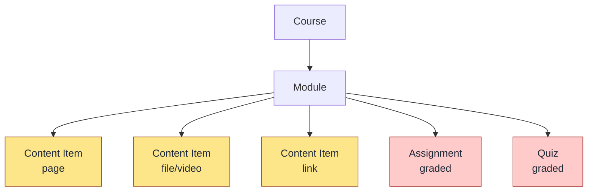
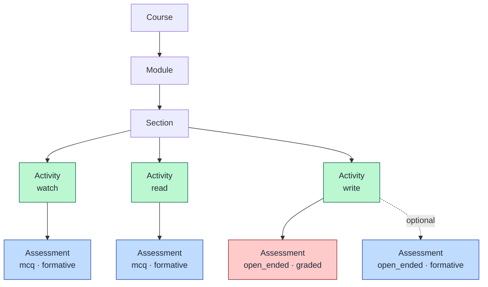

# Content-Centric vs. Activity-Centric

The typical LMS inherits its shape from the textbook: a course is a stack of *content* (pages, files, videos), with assignments tacked on as separate, gradebook-bound artifacts. CoreLMS replaces that with an **activity-centric** model — the unit a learner engages with is an activity (watch / listen / read / write), and assessments are attached to activities, mostly as formative checks.

## Typical LMS (content-centric)

**Properties.**
- Content and assessment are **siblings**, not parent/child. Assessment lives outside the flow of engagement.
- The unit is *what is presented* (a page, a file). Engagement mode is implicit.
- Almost all assessments are summative — they exist to populate the gradebook.
- Authoring mirrors a textbook: chapters of static material, then end-of-chapter problems.

## CoreLMS (activity-centric)

**Properties.**
- The unit is **engagement mode** (`watch | listen | read | write`), not content kind.
- Assessments are **children of activities** — they belong to the moment of engagement, not to the gradebook.
- An activity may have **zero or more assessments**; most are formative (`graded = false`): scored for feedback, not weighted into a grade.
- Completion is tracked per *activity* (`completions` table), independent of assessment outcomes — engagement and evaluation are decoupled.

## Side-by-side

| Dimension | Typical LMS | CoreLMS |
|---|---|---|
| Hierarchy | course → module → **content** + assignment | course → module → **section → activity** → assessment |
| Unit of design | content item (page/file) | activity (mode of engagement) |
| Assessment placement | sibling of content, gradebook-bound | child of activity, mostly formative |
| Default assessment intent | summative | formative |
| Completion signal | view content / submit assignment | per-activity completion record |
| Mental model | textbook | practice loop |

## Why it matters for the next steps

The activity-centric model is the foundation for the next set of changes — generative AI and learning science are easier to slot into a structure where:

- Each activity has an explicit **mode** (so AI assistance can be tuned to it: a tutor for `read`, a coach for `write`, a checker for `watch`).
- Formative assessments are **first-class and cheap to add** — exactly where retrieval practice, spaced repetition, and adaptive feedback live.
- Engagement is tracked separately from grading, leaving room for mastery-based or non-grade-bound progressions.
