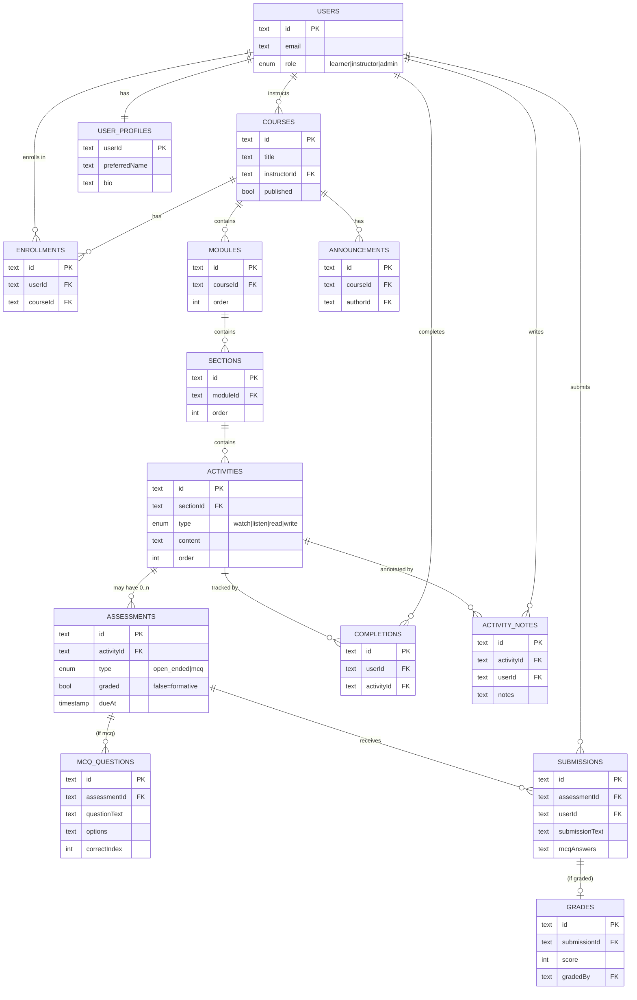

# Domain Model

CoreLMS organizes learning around an **activity-centric** hierarchy. A course is composed of modules, each module of sections, and each section of activities. Activities are the unit of learner engagement; assessments (mostly formative) hang off activities.

## Key invariants

- An **activity** has a `type` describing the mode of engagement (`watch`, `listen`, `read`, `write`) — not a content kind. This is what shifts the model from content-centric to activity-centric.
- An activity may have **zero or more assessments**. Most are formative (`graded = false`): scored for feedback, not for the gradebook.
- A **submission** is unique per `(assessment, user)`. A **grade** exists only for submissions to graded assessments.
- A **completion** is recorded per `(user, activity)` — engagement tracking is at the activity level, independent of assessment outcomes.

## Separate subsystem: OpenStax library

Ingested open content lives in its own table family (`openstax_books → openstax_chapters → openstax_sections`) and is used as a *source* for activity content, not as part of the live course delivery hierarchy.
