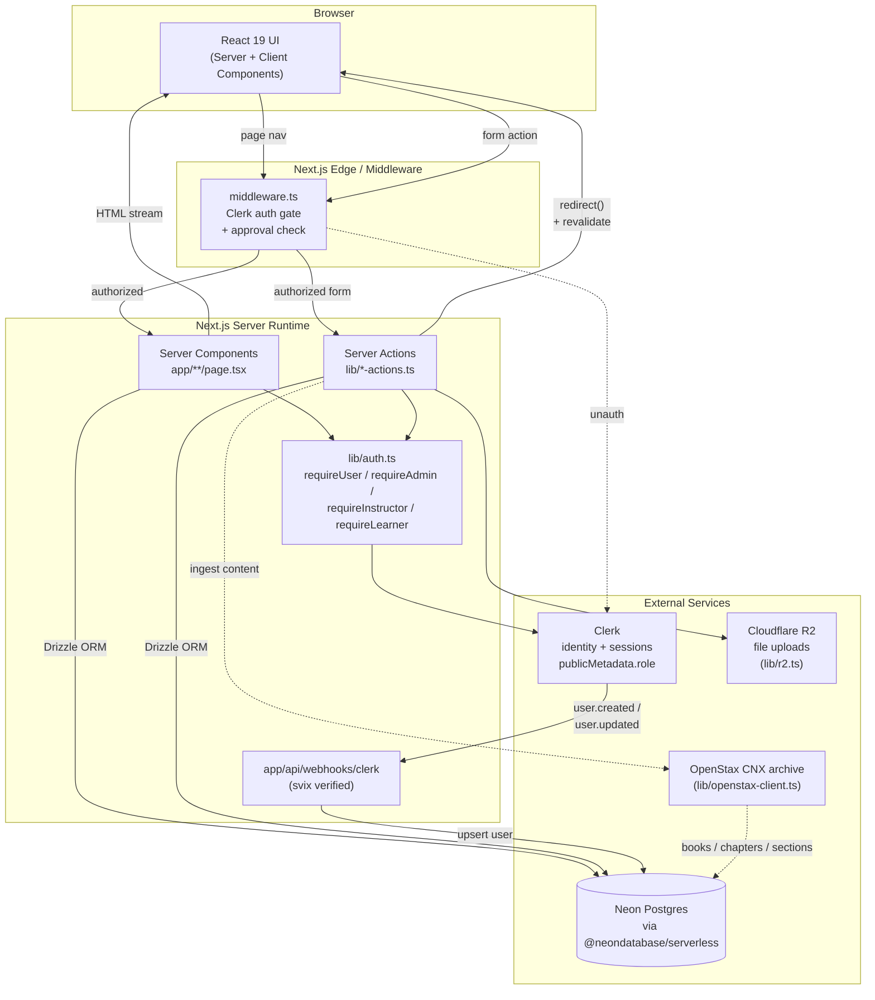

# System Architecture

CoreLMS is a Next.js 16 App Router application. There is **no REST API layer** — mutations flow through React Server Actions directly into Drizzle/Postgres. Authentication is delegated to Clerk; webhooks sync user state into the local `users` table.

## Request lifecycle

1. **Request enters middleware.** `middleware.ts` runs Clerk's auth gate. Public routes (`/`, `/sign-in`, `/sign-up`) pass through. Authenticated users without `publicMetadata.approved` are redirected to `/pending-approval`.
2. **Server Component renders.** Page-level components in `app/**/page.tsx` call `requireUser()` / `requireAdmin()` / etc. from `lib/auth.ts`, then read from Postgres via Drizzle, and stream HTML to the browser.
3. **Mutations via Server Actions.** Forms post to functions in `lib/*-actions.ts` (e.g. `course-actions.ts`, `assessment-actions.ts`). Each action re-checks auth, performs Drizzle writes, and ends with `redirect("/path?notice=...")`.
4. **Identity sync.** Clerk fires webhooks to `app/api/webhooks/clerk`; svix verifies the signature and `lib/user-sync.ts` upserts the local `users` row.
5. **External content.** The admin "ingest" flow pulls OpenStax content into the `openstax_*` tables for later use as activity material.

## Layer responsibilities

| Layer | Path | Responsibility |
|---|---|---|
| Routing / SSR | `app/` | Server-rendered pages, layouts, route handlers |
| Auth gate | `middleware.ts`, `lib/auth.ts` | Session, role, approval checks |
| Mutations | `lib/*-actions.ts` | Server Actions — the only write path |
| Data access | `lib/db.ts`, `lib/schema.ts` | Drizzle client + table definitions |
| Storage | `lib/r2.ts` | File uploads to Cloudflare R2 |
| Ingestion | `lib/openstax-client.ts`, `lib/ingest-actions.ts` | Pull external content |
| UI primitives | `components/ui/` | shadcn-based components |

## What's absent (intentionally)

- **No REST/GraphQL API.** Server Actions replace it.
- **No client-side state library.** Server Components + form submissions cover the surface.
- **No sessions table.** Clerk owns sessions; the local `users` table only mirrors identity for foreign-key integrity.
